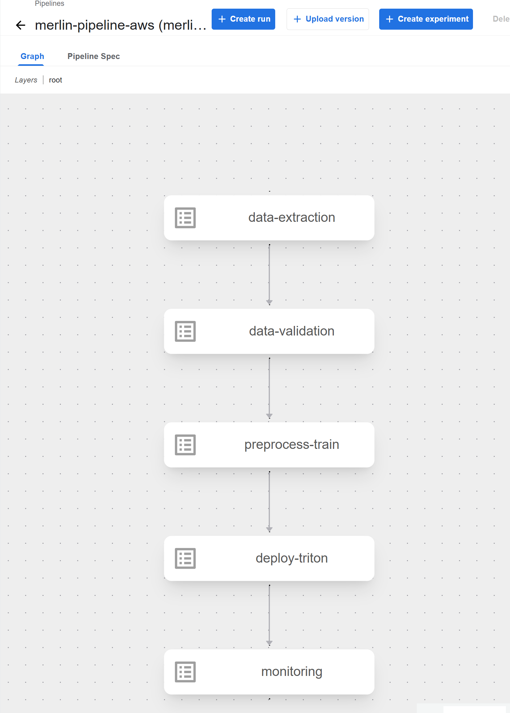
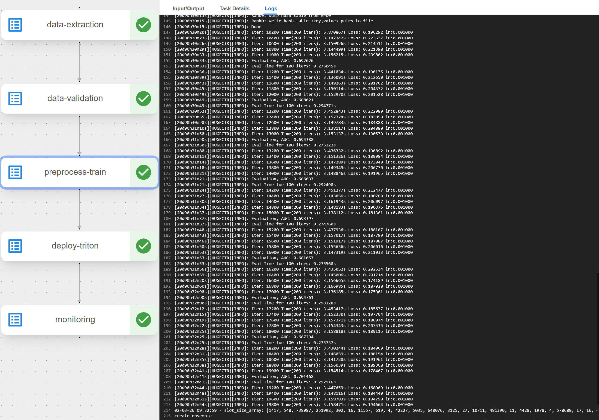
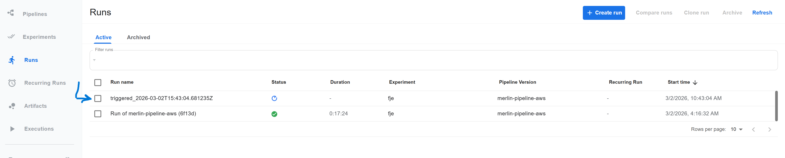
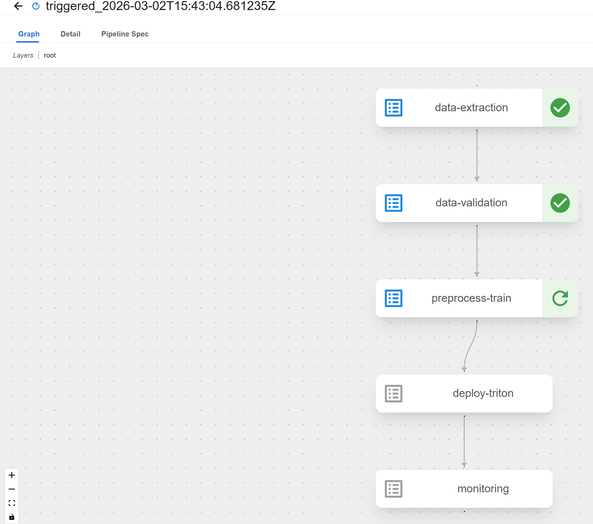

# Deploying a Recommender System with Continuous Retraining on Amazon EKS
*Autoscaling with Karpenter and Kubernetes Horizontal Pod Autoscaler*

## Follow these steps to set up the infrastructure and deploy the recommender system:

Steps 1 through 7 sets up karpenter and creates the nodepools. The instructions (1 - 7) were lifted/ adapted from: https://karpenter.sh/docs/getting-started/getting-started-with-karpenter/
### 1. Set environment variables
```bash
export KARPENTER_NAMESPACE="kube-system"
export KARPENTER_VERSION="1.9.0"
export K8S_VERSION="1.34"
export CLUSTER="${USER}-merlin-cluster"
```

AND  

```bash
export AWS_PARTITION="aws" # AWS has multiple partitions for different regions and compliance requirements. aws/aws-cn/aws-us-gov.
export AWS_DEFAULT_REGION="us-east-1"
export AWS_ACCOUNT_ID="$(aws sts get-caller-identity --query Account --output text)"
export TEMPOUT="$(mktemp)"
export UBUNTU_AMI_ID="$(aws ssm get-parameter \
--name "/aws/service/canonical/ubuntu/eks/24.04/${K8S_VERSION}/stable/current/amd64/hvm/ebs-gp3/ami-id" \
--query Parameter.Value --output text)"
```

### 2. Create a cluster
The configuration will:
* Use CloudFormation to set up the infrastructure needed by the EKS cluster
* Create a Kubernetes service account and AWS IAM Role, and associate them using IRSA to let Karpenter launch instances.
* Add the Karpenter node role to the aws-auth configmap to allow nodes to connect
* Use AWS EKS managed node groups for the kube-system and karpenter namespaces. 
* Set KARPENTER_IAM_ROLE_ARN variables.
* Create a role to allow spot instances.
* Run Helm to install Karpenter.


### 3.  Download Karpenter AWS CloudFormation template for the specified Karpenter version and save it to a temporary file, then deploy the CloudFormation to AWS

```bash
curl -fsSL https://raw.githubusercontent.com/aws/karpenter-provider-aws/v"${KARPENTER_VERSION}"/website/content/en/preview/getting-started/getting-started-with-karpenter/cloudformation.yaml  > "${TEMPOUT}" \
&& aws cloudformation deploy \
--stack-name "Karpenter-${CLUSTER}" \
--template-file "${TEMPOUT}" \
--capabilities CAPABILITY_NAMED_IAM \
--parameter-overrides "ClusterName=${CLUSTER}"
```

### 4.  Set up the cluster metadata, configure IAM with OIDC and associate Karpenter service account with the necessary IAM roles and policies, map the Karpenter node role for EC2 instances with Kubernetes node groups, create managed node group for initial cluster nodes, install `eks-pod-identity-agent` addon.

```bash
eksctl create cluster -f - <<EOF
---
apiVersion: eksctl.io/v1alpha5
kind: ClusterConfig
metadata:
name: ${CLUSTER}
region: ${AWS_DEFAULT_REGION}
version: "${K8S_VERSION}"
tags:
    karpenter.sh/discovery: ${CLUSTER}

iam:
withOIDC: true
podIdentityAssociations:
- namespace: "${KARPENTER_NAMESPACE}"
    serviceAccountName: karpenter
    roleName: ${CLUSTER}-karpenter
    permissionPolicyARNs:
    - arn:${AWS_PARTITION}:iam::${AWS_ACCOUNT_ID}:policy/KarpenterControllerNodeLifecyclePolicy-${CLUSTER}
    - arn:${AWS_PARTITION}:iam::${AWS_ACCOUNT_ID}:policy/KarpenterControllerIAMIntegrationPolicy-${CLUSTER}
    - arn:${AWS_PARTITION}:iam::${AWS_ACCOUNT_ID}:policy/KarpenterControllerEKSIntegrationPolicy-${CLUSTER}
    - arn:${AWS_PARTITION}:iam::${AWS_ACCOUNT_ID}:policy/KarpenterControllerInterruptionPolicy-${CLUSTER}
    - arn:${AWS_PARTITION}:iam::${AWS_ACCOUNT_ID}:policy/KarpenterControllerResourceDiscoveryPolicy-${CLUSTER}

iamIdentityMappings:
- arn: "arn:${AWS_PARTITION}:iam::${AWS_ACCOUNT_ID}:role/KarpenterNodeRole-${CLUSTER}"
username: system:node:{{EC2PrivateDNSName}}
groups:
- system:bootstrappers
- system:nodes
## If you intend to run Windows workloads, the kube-proxy group should be specified.
# For more information, see https://github.com/aws/karpenter/issues/5099.
# - eks:kube-proxy-windows

managedNodeGroups:
- instanceType: m5.large
amiFamily: AmazonLinux2023
name: ${CLUSTER}-ng
desiredCapacity: 1
minSize: 1
maxSize: 10

addons:
- name: eks-pod-identity-agent
EOF
```

### 5.  Store the cluster endpoint, ARN of the Karpenter IAM role, and print both values.

```bash
export CLUSTER_ENDPOINT="$(aws eks describe-cluster --name "${CLUSTER}" --query "cluster.endpoint" --output text)"
export KARPENTER_IAM_ROLE_ARN="arn:${AWS_PARTITION}:iam::${AWS_ACCOUNT_ID}:role/${CLUSTER}-karpenter"

echo "${CLUSTER_ENDPOINT} ${KARPENTER_IAM_ROLE_ARN}"
```

### 6. Install Karpenter  

```bash
# Logout of helm registry to perform an unauthenticated pull against the public ECR
helm registry logout public.ecr.aws

helm upgrade --install karpenter oci://public.ecr.aws/karpenter/karpenter --version "${KARPENTER_VERSION}" --namespace "${KARPENTER_NAMESPACE}" --create-namespace \
--set "settings.clusterName=${CLUSTER}" \
--set "settings.interruptionQueue=${CLUSTER}" \
--set controller.resources.requests.cpu=1 \
--set controller.resources.requests.memory=1Gi \
--set controller.resources.limits.cpu=1 \
--set controller.resources.limits.memory=1Gi \
--wait
```

### 7. Create Nodepools   
* CPU nodepool:   
(m5.xlarge, t3.xlarge) -> you can adjust these based on your needs)  
The `consolidationPolicy` set to `WhenEmptyOrUnderutilized` in the `disruption` block configures Karpenter to reduce cluster cost by removing and replacing nodes. As a result, consolidation will terminate any empty nodes on the cluster. This behavior can be disabled by setting `consolidateAfter` to `Never`, telling Karpenter that it should never consolidate nodes.  
**Note:** This NodePool will create capacity as long as the sum of all created capacity is less than the specified limit.  

    ```bash
    cat <<EOF | envsubst | kubectl apply -f -
    apiVersion: karpenter.sh/v1
    kind: NodePool
    metadata:
    name: cpu-node-pool
    spec:
    limits:
        cpu: 16
    template:
        metadata:
        labels:
            hardware-type: cpu
        spec:
        requirements:
            - key: kubernetes.io/arch
            operator: In
            values: ["amd64"]
            - key: kubernetes.io/os
            operator: In
            values: ["linux"]
            - key: karpenter.sh/capacity-type
            operator: In
            values: ["on-demand"]
            - key: node.kubernetes.io/instance-type
            operator: In
            values: ["m5.xlarge","t3.xlarge"]
        nodeClassRef:
            group: karpenter.k8s.aws
            kind: EC2NodeClass
            name: ubuntu-cpu
    disruption:
        consolidationPolicy: WhenEmptyOrUnderutilized
    ---
    apiVersion: karpenter.k8s.aws/v1
    kind: EC2NodeClass
    metadata:
    name: ubuntu-cpu
    spec:
    role: "KarpenterNodeRole-${CLUSTER}"
    amiFamily: Custom
    amiSelectorTerms:
        - id: "${UBUNTU_AMI_ID}"
    blockDeviceMappings:
        - deviceName: /dev/sda1
          ebs:
           volumeSize: 50Gi
           volumeType: gp3
           deleteOnTermination: true
    subnetSelectorTerms:
        - tags:
            karpenter.sh/discovery: "${CLUSTER}"
    securityGroupSelectorTerms:
        - tags:
            karpenter.sh/discovery: "${CLUSTER}"
    userData: |
        #!/bin/bash
        /etc/eks/bootstrap.sh '${CLUSTER}' \
        --kubelet-extra-args '--register-with-taints=karpenter.sh/unregistered=true:NoExecute'
    EOF
    ```

* Create GPU node pool  
("g4dn.xlarge","g5.xlarge","g6.xlarge")  

    ```bash
    cat <<EOF | envsubst | kubectl apply -f -
    apiVersion: karpenter.sh/v1
    kind: NodePool
    metadata:
    name: gpu-node-pool
    spec:
    limits:
        cpu: 16
    template:
        metadata:
        labels:
            hardware-type: gpu
        spec:
        taints:
            - key: nvidia.com/gpu
            value: "present"
            effect: NoSchedule
        requirements:
            - key: kubernetes.io/arch
            operator: In
            values: ["amd64"]
            - key: kubernetes.io/os
            operator: In
            values: ["linux"]
            - key: karpenter.sh/capacity-type
            operator: In
            values: ["on-demand"]
            - key: node.kubernetes.io/instance-type
            operator: In
            values: ["g4dn.xlarge","g5.xlarge","g6.xlarge"]
        nodeClassRef:
            group: karpenter.k8s.aws
            kind: EC2NodeClass
            name: ubuntu-gpu
    disruption:
        consolidationPolicy: WhenEmptyOrUnderutilized
        consolidateAfter: 1m
    ---
    apiVersion: karpenter.k8s.aws/v1
    kind: EC2NodeClass
    metadata:
    name: ubuntu-gpu
    spec:
    role: "KarpenterNodeRole-${CLUSTER}"
    amiFamily: Custom
    amiSelectorTerms:
        - id: "${UBUNTU_AMI_ID}"
    blockDeviceMappings:
        - deviceName: /dev/sda1
            ebs:
             volumeSize: 100Gi
             volumeType: gp3
             deleteOnTermination: true
    subnetSelectorTerms:
        - tags:
            karpenter.sh/discovery: "${CLUSTER}"
    securityGroupSelectorTerms:
        - tags:
            karpenter.sh/discovery: "${CLUSTER}"
    userData: |
        #!/bin/bash
        /etc/eks/bootstrap.sh '${CLUSTER}' \
        --kubelet-extra-args '--register-with-taints=karpenter.sh/unregistered=true:NoExecute'
    EOF
    ```

### 8. Install NVIDIA GPU Operator

* Install the helm cli (or SKIP if you alreadly have the helm cli):
    ```bash
    curl -fsSL -o get_helm.sh https://raw.githubusercontent.com/helm/helm/master/scripts/get-helm-3 \
    && chmod 700 get_helm.sh \
    && ./get_helm.sh
    ```

* Create a gpu-operator namespace and set the enforcement policy to previleged
    ```bash
    kubectl create ns gpu-operator
    kubectl label --overwrite ns gpu-operator pod-security.kubernetes.io/enforce=privileged
    ```

* Add the NVIDIA Helm repository
    ```bash
    helm repo add nvidia https://helm.ngc.nvidia.com/nvidia \
        && helm repo update
    ```

* Install the GPU Operator (I have chosen driver 570.XX/ cuda 12.x to avoid potential issue with LocalCUDACluster crashing on 580.XX /cuda 13.XX)
```bash
helm install --wait --generate-name \
  -n gpu-operator --create-namespace \
  nvidia/gpu-operator \
  --version=v25.10.1 \
  --set driver.version=570.195.03 \
  --set nodeSelector.hardware-type=gpu \
  --set-json "tolerations=[{\"key\":\"nvidia.com/gpu\",\"operator\":\"Exists\",\"effect\":\"NoSchedule\"}]"
```

* To confirm driver installation, create a pod and run `nvidia-smi` inside the pod (a container):  
i. create cuda-vectoradd.yaml  

```bash
apiVersion: v1
kind: Pod
metadata:
  name: nvidia-smi-pod
spec:
  restartPolicy: Never
  tolerations:
  - key: "nvidia.com/gpu"
    operator: "Exists"
    effect: "NoSchedule"
  containers:
  - name: nvidia-smi
    image: nvidia/cuda:12.2.0-base-ubuntu22.04
    command: ["nvidia-smi"]
    resources:
      limits:
        nvidia.com/gpu: 1
```

ii. run `kubectl apply -f cuda-vectoradd.yaml`  
iii. check logs: `kubectl logs nvidia-smi-pod`  
    
```
    +-----------------------------------------------------------------------------------------+
    | NVIDIA-SMI 570.195.03             Driver Version: 570.195.03     CUDA Version: 12.8     |
    |-----------------------------------------+------------------------+----------------------+
    | GPU  Name                 Persistence-M | Bus-Id          Disp.A | Volatile Uncorr. ECC |
    | Fan  Temp   Perf          Pwr:Usage/Cap |           Memory-Usage | GPU-Util  Compute M. |
    |                                         |                        |               MIG M. |
    |=========================================+========================+======================|
    |   0  NVIDIA A10G                    On  |   00000000:00:1E.0 Off |                    0 |
    |  0%   22C    P8             23W /  300W |       0MiB /  23028MiB |      0%      Default |
    |                                         |                        |                  N/A |
    +-----------------------------------------+------------------------+----------------------+
                                                                                            
    +-----------------------------------------------------------------------------------------+
    | Processes:                                                                              |
    |  GPU   GI   CI              PID   Type   Process name                        GPU Memory |
    |        ID   ID                                                               Usage      |
    |=========================================================================================|
    |  No running processes found                                                             |
    +-----------------------------------------------------------------------------------------+
```  

iv. delete pod: `kubectl delete -f cuda-vectoradd.yaml`


### 9. Add the EFS CSI Driver addon
* Find the EFS CSI driver version compatible with your platform version
    ```bash
    aws eks describe-addon-versions --addon-name aws-efs-csi-driver
    ```
    I chose `v2.3.0-eksbuild.1` for my platform version 1.34

* Create IAM Role for EFS CSI Driver and Update Trust Policy:
    This policy `AmazonEFSCSIDriverPolicy` grants the necessary permissions for the EFS CSI (Container Storage Interface) driver to manage Amazon EFS (Elastic File System) resources from within your EKS cluster. You attach this policy to the IAM role used by the EFS CSI driver service account, so the driver can interact with EFS on your behalf.
    ```bash
    export role_name=AmazonEKS_EFS_CSI_DriverRole_${CLUSTER}
    eksctl create iamserviceaccount \
        --name efs-csi-controller-sa \
        --namespace kube-system \
        --cluster $CLUSTER \
        --role-name $role_name \
        --role-only \
        --attach-policy-arn arn:aws:iam::aws:policy/service-role/AmazonEFSCSIDriverPolicy \
        --approve
    TRUST_POLICY=$(aws iam get-role --output json --role-name $role_name --query 'Role.AssumeRolePolicyDocument' | \
        sed -e 's/efs-csi-controller-sa/efs-csi-*/' -e 's/StringEquals/StringLike/')
    aws iam update-assume-role-policy --role-name $role_name --policy-document "$TRUST_POLICY"
    ```

* create EFS CSI addon
    ```bash
    eksctl create addon --cluster $CLUSTER --name aws-efs-csi-driver --version v2.3.0-eksbuild.1 \
    --service-account-role-arn arn:aws:iam::${AWS_ACCOUNT_ID}:role/${role_name} --force
    ```

### 10. [Install EBS CSI driver](https://docs.aws.amazon.com/eks/latest/userguide/ebs-csi.html)

* Find the driver version compatible with your platform version
    ```bash
    aws eks describe-addon-versions --addon-name aws-ebs-csi-driver
    ```
    v1.55.0-eksbuild.1 works with our platform (kubernetes) version 1.34

* create Amazon EBS CSI driver IAM role for service account and attach `AmazonEBSCSIDriverPolicy`
    ```bash
    eksctl create iamserviceaccount \
    --name ebs-csi-controller-sa \
    --namespace kube-system \
    --cluster $CLUSTER \
    --role-name AmazonEKS_EBS-CSI_DriverRole \
    --role-only \
    --attach-policy-arn arn:aws:iam::aws:policy/service-role/AmazonEBSCSIDriverPolicy \
    --approve
    ```
* create the EBS CSI addon
    ```bash
    eksctl create addon --cluster $CLUSTER --name aws-ebs-csi-driver --version v1.55.0-eksbuild.1 \
    --service-account-role-arn arn:aws:iam::${AWS_ACCOUNT_ID}:role/AmazonEKS_EBS-CSI_DriverRole --force
    ```

* set default StorageClass: I chose gp2
```bash
kubectl patch storageclass gp2 -p '{"metadata": {"annotations":{"storageclass.kubernetes.io/is-default-class":"true"}}}'
```
Why EBS: Some core Kubeflow components need **exclusive** *not* shared storage  (e.g. databases and metadata). EBS is preferred for single pod access.

### 11. [Install Kubeflow Pipelines (Standalone deployment *not* Full)](https://docs.aws.amazon.com/sagemaker/latest/dg/kubernetes-sagemaker-components-install.html#kubeflow-pipelines-standalone)  

I skipped the step *creating a gateway node* because I have a machine that can:  

```
* Call AWS APIs (EKS, IAM, EC2, CloudFormation, S3)

* Talk to the Kubernetes API server

* Authenticate to EKS
```
Also skipped: *Set up an Amazon EKS cluster* (there is an existing cluster)  

i.  [Install the Kubeflow Pipelines.](https://www.kubeflow.org/docs/components/pipelines/operator-guides/installation/)
```bash
export PIPELINE_VERSION=2.16.0
kubectl apply -k "github.com/kubeflow/pipelines/manifests/kustomize/cluster-scoped-resources?ref=$PIPELINE_VERSION"
kubectl wait --for condition=established --timeout=60s crd/applications.app.k8s.io
kubectl apply -k "github.com/kubeflow/pipelines/manifests/kustomize/env/dev?ref=$PIPELINE_VERSION"                             
```

**TAKES APPROX. 3 minutes to complete**

ii. access the Kubeflow pipelines UI  
- port forward the Kubeflow Pipelines UI  
    ```
    kubectl port-forward -n kubeflow svc/ml-pipeline-ui 8080:80
    ```
- Open http://localhost:8080 on your browser to access the Kubeflow Pipelines UI.

### 12. [Create the Elastic file system (EFS)](https://github.com/kubernetes-sigs/aws-efs-csi-driver/blob/master/docs/efs-create-filesystem.md)
a. Where is the cluster?

* `VPC_ID`: Get the virtual network the cluster lives in.
    ```bash
    VPC_ID=$(aws eks describe-cluster --name $CLUSTER --region $AWS_DEFAULT_REGION \
                --query "cluster.resourcesVpcConfig.vpcId" \
                --output text)
    ```

* `CIDR`: Retrieve the CIDR range for your cluster's VPC: I picked the first entry of Vpcs (ie. Vpcs[0]) since Vpcs is a list. 
    ```bash
    cidr_range=$(aws ec2 describe-vpcs \
    --vpc-ids $VPC_ID \
    --query "Vpcs[0].CidrBlock" \
    --output text \
    --region $AWS_DEFAULT_REGION)
    ```

b. Create a security group with an inbound rule that allows inbound NFS traffic for your Amazon EFS mount points.  
* create a security group
    ```bash
    security_group_id=$(aws ec2 create-security-group \
    --group-name MyEFS_SecurityGroup \
    --description "My EFS security group" \
    --vpc-id $VPC_ID \
    --query 'GroupId' \
    --output text)
    ```

* create an inbound rule that allows inbound NFS traffic from the CIDR for your cluster's VPC.    
    ```bash
    aws ec2 authorize-security-group-ingress \
    --group-id $security_group_id \
    --protocol tcp \
    --port 2049 \
    --cidr $cidr_range
    ```

c. create an EFS for the EKS cluster  
* create a file system
    ```bash
    file_system_id=$(aws efs create-file-system \
    --region $AWS_DEFAULT_REGION \
    --performance-mode generalPurpose \
    --query 'FileSystemId' \
    --output text)
    ```
* create mount targets  
    a. Determine the IP (INTERNAL-IP) addresses of your cluster nodes.
    ```
    kubectl get nodes -o wide
    ```

    b. Determine the IDs of the subnets in your (cluster) VPC and which Availability Zone the subnet is in.  
    ```bash
    aws ec2 describe-subnets \
        --filters "Name=vpc-id,Values=$VPC_ID" \
        --query 'Subnets[*].{SubnetId: SubnetId,AvailabilityZone: AvailabilityZone,CidrBlock: CidrBlock}' \
        --output table
    ```

    c. fetch the nodepool subnets: the subnets Karpenter will launch nodes into
    ```bash
    SUBNETS=$(aws ec2 describe-subnets \
    --region "$AWS_DEFAULT_REGION" \
    --filters "Name=vpc-id,Values=$VPC_ID" "Name=tag:karpenter.sh/discovery,Values=$CLUSTER" \
    --query "Subnets[].SubnetId" --output text | tr '\t' '\n' | sort -u)
    echo "$SUBNETS"
    ```
    The script reads the unique subnets (sort -u).

    d. create one mount target per AZ (avoid duplicates)  
    EFS allows one mount target per AZ, so don’t blindly loop every subnet if you have multiple subnets in the same AZ. Th loop pick the first subnet it sees per AZ
```bash
declare -A SEEN_AZ
while read -r sn az; do
  [[ -z "$sn" || -z "$az" ]] && continue
  if [[ -z "${SEEN_AZ[$az]}" ]]; then
    aws efs create-mount-target \
      --region "$AWS_DEFAULT_REGION" \
      --file-system-id "$file_system_id" \
      --subnet-id "$sn" \
      --security-groups "$security_group_id" >/dev/null
    SEEN_AZ[$az]=1
    echo "Created mount target in $az using $sn"
  else
    echo "Skipping $sn (already created mount target in $az)"
  fi
done < <(aws ec2 describe-subnets \
  --region "$AWS_DEFAULT_REGION" \
  --subnet-ids $SUBNETS \
  --query 'Subnets[].[SubnetId,AvailabilityZone]' \
  --output text)
```  

e.  now create the mount targets for our EFS file system  
    
```bash
    for sn in $SUBNETS; do
    aws efs create-mount-target --file-system-id $file_system_id --subnet-id $sn --security-groups $security_group_id --region $REGION >/dev/null
    done
```

f. optional: confirm mount targets created.
```bash
    aws efs describe-mount-targets --file-system-id $file_system_id --region $REGION \
    --query 'MountTargets[].{Subnet:SubnetId,AZ:AvailabilityZoneId,State:LifeCycleState,IP:IpAddress}' --output table
```
output like:
```bash
----------------------------------------------------------------------------------------------------
|                                       DescribeMountTargets                                       |
+----------+------------------+--------------------------+------------+----------------------------+
|    AZ    |       IP         |           Id             |   State    |          Subnet            |
+----------+------------------+--------------------------+------------+----------------------------+
|  use1-az6|  192.xxx.yyy.xxx |  fsmt-0hihihihihihihihih |  available |  subnet-hahahahahahahahah  |
|  use1-az1|  192.xxx.yy.cc   |  fsmt-0merrymrrymrymerr  |  available |  subnet-mehdjhdmjdjdjdjej  |
+----------+------------------+--------------------------+------------+----------------------------+
```

### 13. Create the storage class and persistent volume claim. CSI dynamic provisioning creates PV automatically (reason for efs-ap provisioning mode).  
* create yaml file: *efs-storage.yaml*
    ```yaml
    apiVersion: storage.k8s.io/v1
    kind: StorageClass
    metadata:
    name: efs-sc
    provisioner: efs.csi.aws.com
    parameters:
    provisioningMode: efs-ap         # dynamic access points
    fileSystemId: FSID_REPLACE_ME
    directoryPerms: "777"
    mountOptions:
    - tls
    ---
    apiVersion: v1
    kind: PersistentVolumeClaim
    metadata:
    name: my-cluster-pvc
    spec:
    accessModes: [ReadWriteMany]
    storageClassName: efs-sc
    resources:
        requests:
        storage: 100Gi
    ```
    Note: `resources.capacity` is actually ignored by Amazon EFS CSI driver when provisioning the volume claim because Amazon EFS is an elastic file system. Capacity is only specified because it is a required field in Kubernetes. The value doesn't limit the size of your Amazon EFS file system.

* inject file system ID into the yaml and apply the configuration. Ensure to create the PVC in kubeflow namespace so KFP pipelines, which will later be created in the same namespace, can access it.
    ```bash
    sed "s/FSID_REPLACE_ME/$file_system_id/g" efs-storage.yaml | kubectl apply -n kubeflow -f -
    ```

* optional: confirm sc and pvc created
    ```bash
    kubectl get sc,pvc -n kubeflow
    ```

* bonus: test the persistent volume claim  
    i. create a pod named *`efs-test`*   
    (PS: YOU can test many pods on the volume)
    ```bash
    kubectl run efs-test --image=busybox --restart=Never --overrides='{"spec":{"containers":[{"name":"efs-test","image":"busybox","command":["sleep","3600"],"volumeMounts":[{"name":"efs-vol","mountPath":"/var/lib/data"}]}],"volumes":[{"name":"efs-vol","persistentVolumeClaim":{"claimName":"my-cluster-pvc"}}]}}' -n kubeflow
    ```
    creates a pod with `busybox` image, with volume mount at `"/var/lib/data/"` 

    ii. exec into the pod
    ```bash
    kubectl exec -it efs-test -n kubeflow -- sh
    ```
    iii. Once inside the shell environment, test the EFS mount like so:
    ```bash
    ls /var/lib/data && mkdir -p /var/lib/data/criteo-data && echo "EFS test successful" > /var/lib/data/criteo-data/test.txt && cat /var/lib/data/criteo-data/test.txt
    ```
    iv. clean up
    ```bash
    kubectl delete pod efs-test -n kubeflow
    ```
### 14. Create a Service Account and RBAC Role for Pipeline Components to Access Helm and Deploy pods, etc.
The data extraction and preprocess-train components need permission to check Helm release status for Triton (`triton_status=$(helm status triton 2>&1)`).   
**Note:** the RBAC permissions in the Role apply to all pods, services, deployments and replicasets in the `kubeflow` namespace. Any pod or component using the `merlin-kfp-sa` service account will have these permissions for those resource types.
```bash
kubectl apply -f - <<EOF
apiVersion: v1
kind: ServiceAccount
metadata:
  name: merlin-kfp-sa
  namespace: kubeflow
---
apiVersion: rbac.authorization.k8s.io/v1
kind: Role
metadata:
  name: merlin-kfp-role
  namespace: kubeflow
rules:
# For helm status and install (secrets store helm releases)
- apiGroups: [""]
  resources: ["secrets", "configmaps"]
  verbs: ["get", "list", "create", "update", "patch", "delete"]
# For deploying Triton
- apiGroups: [""]
  resources: ["pods", "pods/log", "services"]
  verbs: ["get", "list", "watch", "create", "update", "patch", "delete"]
- apiGroups: ["apps"]
  resources: ["deployments", "replicasets"]
  verbs: ["get", "list", "watch", "create", "update", "patch", "delete"]
# For argo workflows
- apiGroups: ["argoproj.io"]
  resources: ["workflows", "workflowtaskresults"]
  verbs: ["get", "list", "watch", "create", "update", "patch"]
- apiGroups: ["monitoring.coreos.com"]
  resources: ["servicemonitors"]
  verbs: ["get", "list", "create", "update", "patch", "delete"]
---
apiVersion: rbac.authorization.k8s.io/v1
kind: RoleBinding
metadata:
  name: merlin-kfp-binding
  namespace: kubeflow
subjects:
- kind: ServiceAccount
  name: merlin-kfp-sa
  namespace: kubeflow
roleRef:
  kind: Role
  name: merlin-kfp-role
  apiGroup: rbac.authorization.k8s.io
EOF
```
Verify service account
```bash
kubectl get serviceaccount merlin-kfp-sa -n kubeflow
kubectl get role merlin-kfp-role -n kubeflow
kubectl get rolebinding merlin-kfp-binding -n kubeflow
```

### 15. Upload training data to S3 bucket: you need at least two files -- at least one for training and one for validation

* create the bucket
    ```bash
    export BUCKET=bucket-recsys #please replace
    aws s3 mb s3://$BUCKET --region $REGION
    ```

* upload the files to the bucket
    ```bash
    aws s3 cp day_0.parquet s3://$BUCKET/initial_criteo/day_0.parquet && aws s3 cp day_1.parquet s3://$BUCKET/initial_criteo/day_1.parquet
    ```

* expected order:
    ```bash
    s3://bucket-name
        └──initial_criteo
        │   ├──day_0.parquet  
        │   └──day_1.parquet
        │ 
        └──new_data
    ```
Note: `day_0.parquet`and `day_1.parquet` are randomly sampled subsets from one day of the [Criteo 1TB Click Logs dataset](https://ailab.criteo.com/download-criteo-1tb-click-logs-dataset/) that have been converted to parquet files using this [Notebook](https://github.com/NVIDIA-Merlin/NVTabular/blob/v0.7.1-docs/examples/scaling-criteo/01-Download-Convert.ipynb) 
 In the initial training run, `day_0.parquet` and `day_1.parquet` are the train and valid datasets, repectively.

### 16. Create the SQS queue. 
Ensure to replace `QUEUE_NAME` with your desired name, e.g., `merlin-inference-requests`
```bash
export QUEUE_NAME='merlin-inference-requests' #please replace

QUEUE_URL=$(aws sqs create-queue \
    --queue-name QUEUE_NAME \
    --region $AWS_DEFAULT_REGION \
    --attributes VisibilityTimeout=300,MessageRetentionPeriod=345600 \
    --query 'QueueUrl' \
    --output text 2>/dev/null || \
    aws sqs get-queue-url --queue-name $QUEUE_NAME --region $AWS_DEFAULT_REGION --query 'QueueUrl' --output text)

export QUEUE_ARN=$(aws sqs get-queue-attributes \
    --queue-url "$QUEUE_URL" \
    --attribute-names QueueArn \
    --query 'Attributes.QueueArn' \
    --output text)

echo "Queue URL: $QUEUE_URL"
echo "QUEUE_ARN: $QUEUE_ARN"
```
Please save the QUEUE_URL, you are going to need it later.

### 17. Create the policies for S3 and SQS access.
* S3 bucket access policy
```bash
cat > s3-full-${BUCKET}.json <<EOF
{
  "Version": "2012-10-17",
  "Statement": [
    {
      "Effect": "Allow",
      "Action": "s3:*",
      "Resource": [
        "arn:aws:s3:::${BUCKET}",
        "arn:aws:s3:::${BUCKET}/*"
      ]
    }
  ]
}
EOF

aws iam create-policy \
  --policy-name merlin-s3-${BUCKET}-full \
  --policy-document file://s3-full-${BUCKET}.json
```

* SQS queue access policy
```bash
cat > sqs-full-${QUEUE_NAME}.json <<EOF
{
  "Version": "2012-10-17",
  "Statement": [
    {
      "Effect": "Allow",
      "Action": "sqs:*",
      "Resource": "${QUEUE_ARN}"
    }
  ]
}
EOF

aws iam create-policy \
  --policy-name merlin-sqs-${QUEUE_NAME}-full \
  --policy-document file://sqs-full-${QUEUE_NAME}.json
```


### 18. Update the service account with an IAM role for S3 & SQS access.
* First, create the IAM role with the S3/SQS access policies attached. Ensure not to override the existing service account (merlin-kfp-sa) by using the --role-only flag.
    ```bash
    export NAMESPACE=kubeflow
    export SERVICE_ACCOUNT=merlin-kfp-sa
    export ROLE_NAME=merlin-kfp_irsa-role
    ```

    ```bash
    eksctl create iamserviceaccount \
    --cluster $CLUSTER \
    --region $AWS_DEFAULT_REGION \
    --namespace $NAMESPACE \
    --name $SERVICE_ACCOUNT \
    --role-name $ROLE_NAME \
    --attach-policy-arn arn:aws:iam::${AWS_ACCOUNT_ID}:policy/merlin-s3-${BUCKET}-full \
    --attach-policy-arn arn:aws:iam::${AWS_ACCOUNT_ID}:policy/merlin-sqs-${QUEUE_NAME}-full \
    --role-only \
    --approve
    ```

* Next, annotate the existing service account with the newly created role
    ```bash
    kubectl -n $NAMESPACE annotate serviceaccount $SERVICE_ACCOUNT \
    eks.amazonaws.com/role-arn=arn:aws:iam::$AWS_ACCOUNT_ID:role/$ROLE_NAME \
    --overwrite
    ```

### 19. Install Prometheus and Grafana
* Install the kube-prometheus-stack which includes Prometheus Operator, Prometheus, and Grafana.
    ```bash
    export GRAFANA_ADMIN_USERNAME=yourusernameREPLACE # replace
    export GRAFANA_ADMIN_PASSWORD=yourChosenPasswordREPLACE # replace
    ```

    ```bash
    helm repo add prometheus-community https://prometheus-community.github.io/helm-charts
    helm repo update
    helm install prometheus prometheus-community/kube-prometheus-stack \
        -n monitoring \
        --create-namespace \
        --set grafana.adminUser=$GRAFANA_ADMIN_USERNAME \
        --set grafana.adminPassword=$GRAFANA_ADMIN_PASSWORD
    ```  

* you can always fetch your username and password:
    ```bash
    kubectl --namespace monitoring get secrets prometheus-grafana -o jsonpath="{.data.admin-user}" | base64 -d ; echo
    kubectl --namespace monitoring get secrets prometheus-grafana -o jsonpath="{.data.admin-password}" | base64 -d ; echo 
    ```
* Update Prometheus to scrape all ServiceMonitors where release is either "triton" or "prometheus":
    ```bash
    helm upgrade prometheus prometheus-community/kube-prometheus-stack -n monitoring \
    --reuse-values \
    --set-json 'prometheus.prometheusSpec.serviceMonitorSelector={"matchExpressions":[{"key":"release","operator":"In","values":["prometheus","triton"]}]}'
    ```
    This ensures it is able to scrape `release: triton` ServiceMonitors; as well as its own internal components with: `release: prometheus`

* Verify installation:
    ```bash
    kubectl get pods -n monitoring
    kubectl get crd | grep monitoring.coreos.com
    ```

* Access Grafana (optional):
    ```bash
    kubectl port-forward svc/prometheus-grafana -n monitoring 3000:80
    # Open http://localhost:3000 (admin/admin)
    ```

### 20. Build and push containers to ECR
#### a. Data extraction & Triton deployment container:  
* navigate to the project root, then run the scripts below (ensure to replace `AWS_ACCOUNT_ID` and `REGION`):
    ```bash
    chmod +x build_copy_container_aws.sh
    ./build_copy_container_aws.sh AWS_ACCOUNT_ID REGION
    ```
    this builds the image, tags it and pushes it to ECR repo. The URI of the pushed image is saved to .image_uris/data_extraction.txt  
    This container will also be used to deploy the Triton inference server.

#### b. Data validation container
* navigate to the project root, then run the scripts below (ensure to replace `AWS_ACCOUNT_ID` and `REGION`):
    ```bash
    chmod +x build_validation_component.sh
    ./build_validation_component.sh AWS_ACCOUNT_ID REGION
    ```
    this builds the image, tags it and pushes it to ECR repo. The URI of the pushed image is saved to .image_uris/data_validation.txt

#### c. Preprocessing & Training container
* navigate to the project root, then run the scripts below (ensure to replace `AWS_ACCOUNT_ID` and `REGION`):  
    ```bash
    chmod +x build_training_container.sh
    ./build_training_container.sh AWS_ACCOUNT_ID REGION
    ```
    this builds the image, tags it 0.5.1 and pushes it to ECR repo. The URI of the pushed image is saved to .image_uris/training.txt


#### d. Inference container
* Pull, tag, and push the merlin-inference:0.5.1 container to ECR. Navigate to the project root, then run the scripts below (ensure to replace `AWS_ACCOUNT_ID` and `REGION`)  
    ```bash
    chmod +x push_inference_container.sh
    ./push_inference_container.sh AWS_ACCOUNT_ID REGION
    ```
#### e. Deployment container
* The data extraction container will be used by the Kubeflow pipeline to deploy the Triton inference server.

#### f. Monitoring container
* save the kfp client in text file `kfp_client_host_key.txt` in the monitoring folder.
* navigate to the project root, then run the scripts below (ensure to replace `AWS_ACCOUNT_ID` and `REGION`): 
    ```bash
    chmod +x build_monitoring_container_aws.sh
    ./build_monitoring_container_aws.sh AWS_ACCOUNT_ID REGION
    ```

### 21. Tag the shared node security group (SG) so Kubernetes LoadBalancer can identify the SG of the cluster. 
The Cluster nodes currently have multiple SGs attached. Without the Kubernetes cluster tag, the controller can't safely choose the correct SG when creating the LoadBalancer, so it fails with "Multiple untagged security groups found.."
* find the worker-node shared SG
    ```bash
    NODE_SG=$(aws ec2 describe-security-groups \
    --region "$AWS_DEFAULT_REGION" \
    --filters \
        "Name=vpc-id,Values=$VPC_ID" \
        "Name=tag:alpha.eksctl.io/cluster-name,Values=$CLUSTER" \
        "Name=tag:aws:cloudformation:logical-id,Values=ClusterSharedNodeSecurityGroup" \
    --query 'SecurityGroups[0].GroupId' \
    --output text)
    ```
* tag the node 
    ```bash
    aws ec2 create-tags \
    --region "$AWS_DEFAULT_REGION" \
    --resources "$NODE_SG" \
    --tags "Key=kubernetes.io/cluster/$CLUSTER,Value=owned"
    ```

* verify tag
```bash
aws ec2 describe-security-groups \
  --region "$AWS_DEFAULT_REGION" \
  --group-ids "$NODE_SG" \
  --query 'SecurityGroups[0].Tags'
```
### 22. Deploy the Horizontal Pod Autoscaler
The YAML files are located in the [scaling_yamls](../scaling_yamls) directory
* create the `custom-metrics` namespace. Some of the the manifests reference this namespace; the namedspaced resources including ConfigMap, Deployment, ServiceAccount, Service will fail to create without it.

    ```bash
    kubectl create namespace custom-metrics
    ```
* apply [custom-metric-server-config.yaml](../scaling_yamls/custom-metric-server-config.yaml)
    ```bash
    kubectl apply -f custom-metric-server-config.yaml
    ```
    Deploys the ConfigMap which defines the translation rule i.e.,
    
    - Uses the raw triton metrics `nv_inference_queue_duration_us` and `nv_inference_request_success`, to compute **`avg_time_queue_ms`**.  

    - **`avg_time_queue_ms`** = `'avg(delta(nv_inference_queue_duration_us{<<.LabelMatchers>>}[30s])/(1+delta(nv_inference_request_success{<<.LabelMatchers>>}[30s]))/1000) by (<<.GroupBy>>)'` and exposes this `avg_time_queue_ms`to HPA.

* apply [custom-metric-server-rbac.yaml](../scaling_yamls/custom-metric-server-rbac.yaml): role-based access control (RBAC) 
    ```bash
    kubectl apply -f custom-metric-server-rbac.yaml
    ```
    - allows custom metrics adapter to read kubernetes resources and auth config; allows HPA controller to read custom metrics API.

* apply [custom-metric-server.yaml](../scaling_yamls/custom-metric-server.yaml)
    ```bash
    kubectl apply -f custom-metric-server.yaml
    ```
    - runs the Prometheus Adapter pod and points it to Prometheus:  
        `http://<PROMETHEUS_SERVICE_NAME>.<PROMETHEUS_NAMESPACE>.svc.cluster.local:9090`
    - mounts the adapter config deployed earlier.
    - registers APIService custom.metrics.k8s.io so Kubernetes/HPA can query it.

* apply [triton-hpa.yaml](../scaling_yamls/triton-hpa.yaml)
    ```bash
    kubectl apply -f triton-hpa.yaml
    ```
    - creates horizontal pod autoscaler (HPA) resource which adjusts the number of pods in the specified target (the triton-triton-inference-server deployment) based on the custom metric (`avg_time_queue_ms`) that was exposed for the kubeflow namespace by the prometheus custom metrics adapter. If the metric value exceeds 200 milliseconds, the HPA will scale up the number of replicas in the target to 2 and will scale down to 1 if metric falls below 200 miiliseconds.


### 23. Compile Kubeflow Pipeline
* start by installing the kubeflow pipelines SDK (`kfp`) and `kfp-kubernetes` on your gateway node.
    * create a conda environment and activate it
        ```bash
        conda create -n kfp-env python=3.12
        conda activate kfp-env
        ```

    * Install kubeflow pipelines and kfp-kubernetes
        ```bash
        pip install kfp==2.15.2
        pip install kfp-kubernetes==2.15.2
        ```
* compile pipeline
    ```bash
    python merlin-pipeline.py \
    -dexc "$(cat .image_uris/data_extraction.txt)" \
    -dvc "$(cat .image_uris/validation.txt)" \
    -ptc "$(cat .image_uris/training.txt)" \
    -dc "$(cat .image_uris/data_extraction.txt)" \
    -mc "$(cat .image_uris/monitoring.txt)"
    ```
    This creates `merlin-pipeline-aws.yaml` 
* upload this yaml in the Kubeflow UI:
    ```bash
    kubectl port-forward -n kubeflow svc/ml-pipeline-ui 8080:80
    ```
    The kubeflow Pipelines UI can be accessed at:  http://localhost:8080

* You should see this DAG
    

* Click `Create experiment` to create an experiment. Then, create `Create run`.
Enter the service account name we created earlier, e.g.,`merlin-kfp-sa` in the "Service Account" field. Argo (Workflow) will create the pods with this service account so pods automatically inherit the permissions associated with this service account.

* Fill out all other fields and hit Start:   
    

* The pipeline components are executed sequentially as shown in the DAG, from data-extraction to monitoring. You can click on the Logs tab in the UI to view the log of a component. 
    

### 24. Test the Performance Monitor.
* Once the pipeline run in previous step completes, you can test the monitoring module by sending inference requests using the sample python app [performance-test.py](client_app/performance-test.py):
    - Ensure to start the app in an environment with `tritonclient` installed. I would recommend running it inside a container like: `nvcr.io/nvidia/merlin/merlin-inference:0.5.1`. Replace the placeholders in the sample command below.
    
        ```sh
        python3 performance-test.py \
            --triton_grpc_url <LOAD_BALANCER_URL>:8001 \
            --model_name hugectr_dcn_ens \
            --test_data day_1.parquet \
            --batch_size 64 \
            --n_batches 30 \
            --queue_url <SQS_URL> \
            --verbose False
        ```
    - Once drift is detected, a new pipeline run that performs incremental training is triggered. This triggered run executes the complete pipeline tasks as before; however, training is warm-started from previous model checkpoints, and only the new training data is used. See the screenshots of from a drift-triggered run below:

        

        AND  

        The tasks are executed starting from data-extraction:

        