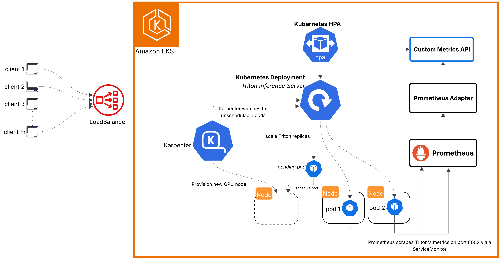

# **Recommender System with Continuous Retraining on Amazon EKS with NVIDIA Merlin, HugeCTR, NVIDIA Triton Inference server, and Kubeflow Pipelines**

This project is a deep learning based recommender system with continuous retraining. The recommendation model predicts Click Through Rates (CTR) and automatically retrains when performance degrades. This set up utilizes technologies including Amazon Elastic Kubernetes Service (EKS), NVIDIA Triton Inference Server, NVIDIA Merlin (NVTabular, HugeCTR), and Kubeflow Pipelines. 

* [Amazon Elastic Kubernetes Service (EKS)](https://docs.aws.amazon.com/eks/latest/userguide/what-is-eks.html) is a fully managed Kubernetes service that can scale nodes to meet changing workload demands.

* [NVIDIA Triton Inference Server](https://docs.nvidia.com/deeplearning/triton-inference-server/user-guide/docs/index.html) is an open source inference serving software that enables the deployment of AI/ML models from frameworks including HugeCTR, PyTorch, TensorFlow, TensorRT, et cetera.

* [NVIDIA Merlin](https://developer.nvidia.com/merlin) is an open source framework for building recommender systems at scale.

* [Kubeflow Pipelines](https://www.kubeflow.org/docs/components/pipelines/overview/) (KFP) is an open source platform for writing machine learning workflows natively in Python and deploying them on Kubernetes-based systems.

* [Karpenter](https://karpenter.sh/) is an open source software application that launches and terminates compute resources in a Kubernetes cluster to handle changes in workload demands.

## Autoscaling with Karpenter (self-managed) and Horizontal Pod Autoscaler 
Triton pods in this infrastructure are scaled using Kubernetes HPA with Custom metrics and the Cluster Nodes are managed/scaled by Karpenter.

## Deployment Instructions
Please visit *[documentation/setup_instructions.md](https://github.com/MustaphaU/Merlin-RecSys-MLOps-on-AWS/blob/main/Merlin-MLOps-on-AWS-with-Karpenter/documentation/setup_instructions.md)* to deploy in your AWS account.

## Acknowledgements:
This work was inspired by [Merlin MLOps with Kubeflow Pipelines on Google Kubernetes Engine](https://developer.nvidia.com/blog/continuously-improving-recommender-systems-for-competitive-advantage-with-merlin-and-mlops/); in fact, it is an adaptation of the [Merlin - MLOps on GKE project on GitHub](https://github.com/NVIDIA-Merlin/gcp-ml-ops?tab=readme-ov-file#merlin---mlops-on-gke) for deployment on Amazon EKS. Therefore, you will find that some of the ideas in the referenced project are replicated in this implementation and most of the code has been reused but updated to use AWS and to work with updated SDKs.

## References:

1. [Continuously Improving Recommender Systems for Competitive Advantage Using NVIDIA Merlin and MLOps by Shashank Verma, Abhishek Sawarkar, Vinh Nguyen, and Davide Onofrio](https://developer.nvidia.com/blog/continuously-improving-recommender-systems-for-competitive-advantage-with-merlin-and-mlops/)
2. [Merlin - MLOps on GKE](https://github.com/NVIDIA-Merlin/gcp-ml-ops?tab=readme-ov-file#merlin---mlops-on-gke)
